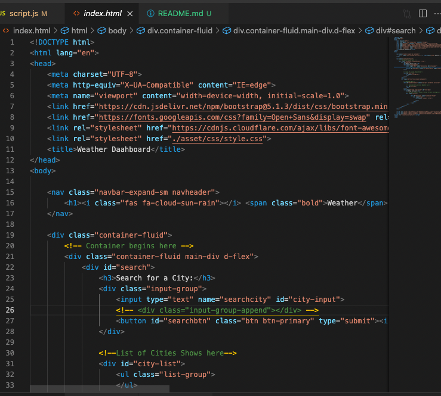
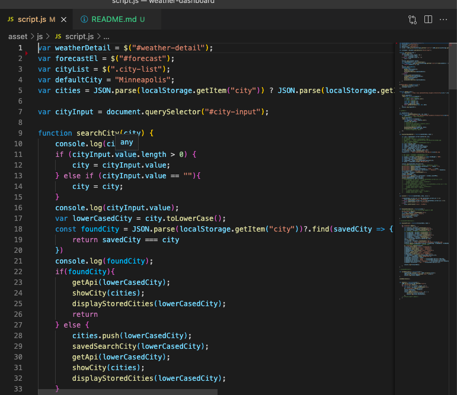
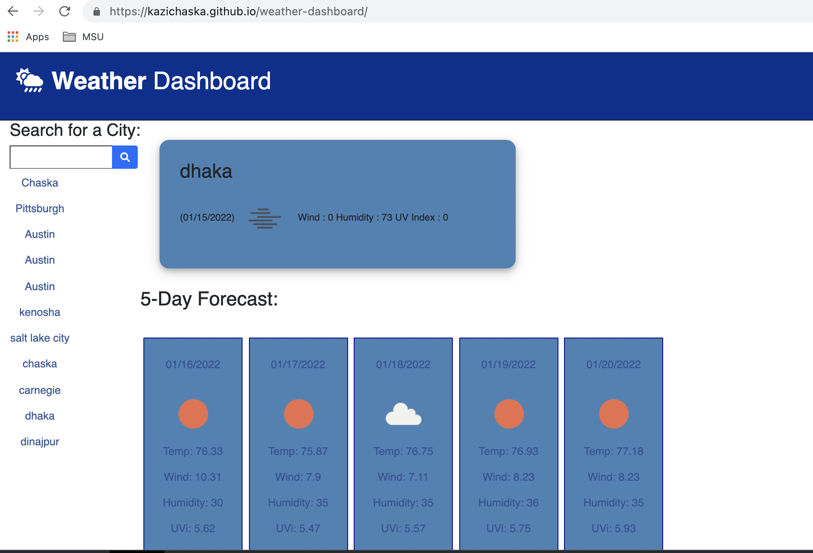
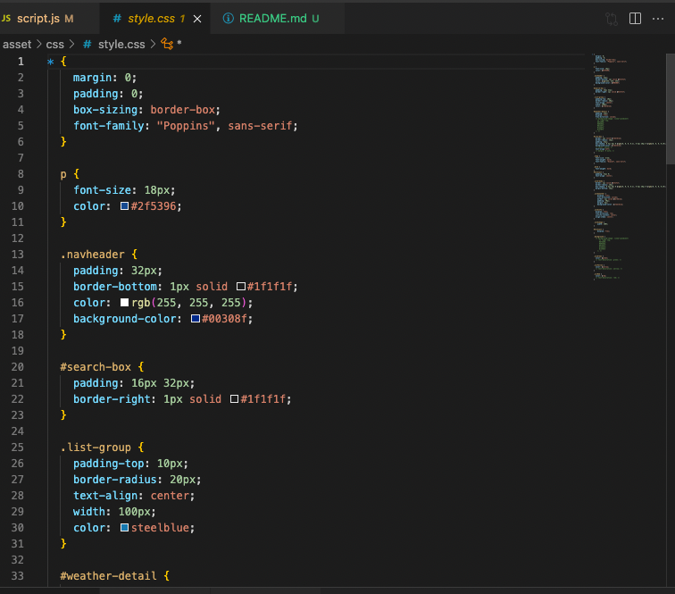

# WeatherPulse - Real-Time Weather Dashboard

### 🌐 Live Demo & Repository
- **Deployed Application:** https://weatherpulse.netlify.app (Update with your deployment URL)
- **GitHub Repository:** https://github.com/kazichaska/weather-dashboard

### ✨ Description
WeatherPulse is a cutting-edge weather dashboard that provides real-time weather data and 5-day forecasts with AI-powered weather insights. Built with modern technologies, it features a vibrant, responsive design with glass-morphism effects and smooth animations.

## 🎯 Features

- ✨ **Modern Vibrant Design** - Neon gradients with glass-morphism effects
- 🌍 **Global Weather Search** - Get weather for any city worldwide
- 📊 **Current Weather Details** - Temperature, humidity, wind speed, pressure, cloudiness
- 📅 **5-Day Forecast** - Upcoming weather predictions with detailed information
- 🧠 **AI Insights** - Smart, personalized weather recommendations
- 💬 **Contact Developer** - Easy-to-use contact form with hover modal
- 📱 **Fully Responsive** - Perfect on desktop, tablet, and mobile
- 🔍 **SEO Optimized** - Better search engine visibility
- 🎨 **Smooth Animations** - Delightful user interactions

## 🚀 Deployment Guide

### Deploy to Netlify (Recommended - Easiest)

1. **Initialize Git & Push to GitHub:**
   ```bash
   git init
   git add .
   git commit -m "Initial commit: WeatherPulse dashboard"
   git branch -M main
   git remote add origin https://github.com/YOUR_USERNAME/weather-dashboard.git
   git push -u origin main
   ```

2. **Connect to Netlify:**
   - Go to [Netlify Dashboard](https://app.netlify.com/)
   - Click "Add new site" → "Import an existing project"
   - Select GitHub and your repository
   - Build settings:
     - Build command: (leave empty)
     - Publish directory: `.`
   - Click "Deploy site"
   - Netlify will auto-read `netlify.toml` configuration

3. **Set Custom Domain:**
   - Site settings → Domain management → Add custom domain
   - Configure DNS settings if needed

### Deploy to Render

1. **Push to GitHub (same as above)**

2. **Connect to Render:**
   - Go to [Render Dashboard](https://dashboard.render.com/)
   - Click "New" → "Static Site"
   - Connect GitHub account and select repository
   - Settings:
     - Build command: (leave empty)
     - Publish directory: `.`
   - Click "Create Static Site"
   - Render will deploy automatically

## 📁 Project Structure

```
weather-dashboard/
├── index.html              # Main HTML file with SEO meta tags
├── netlify.toml           # Netlify deployment configuration
├── .gitignore             # Git ignore rules
├── README.md              # This file
└── asset/
    ├── css/
    │   └── style.css      # Complete styling with animations
    ├── js/
    │   └── script.js      # All JavaScript functionality
    └── images/            # (Optional) Image assets
```

## 🔑 API Keys & Services

### 1. OpenWeatherMap API
- **Purpose:** Real-time weather data and 5-day forecasts
- **Free Tier:** 60 calls/min, 1M calls/month
- **Status:** ✅ Already configured
- **Get Key:** https://openweathermap.org/api
- **Location:** In `asset/js/script.js` (lines ~48, ~102)

### 2. Formspree Email Service
- **Purpose:** Contact form email forwarding
- **Free Tier:** 50 emails/month
- **Status:** ✅ Already configured
- **Location:** In `asset/js/script.js` (line ~44)
- **Update ID:** Change `f/mjgkjddn` to your Formspree form ID

## 🛠️ Technologies Used

- **Frontend:**
  - HTML5 (Semantic markup)
  - CSS3 (Gradients, animations, flexbox, grid)
  - JavaScript (Vanilla JS - no dependencies)
  - jQuery (DOM manipulation)
  - Bootstrap 5 (Responsive utilities)

- **Libraries & Frameworks:**
  - Moment.js (Date & time formatting)
  - Font Awesome 6 (Icon library)
  - Google Fonts (Poppins, Inter)

- **External APIs:**
  - OpenWeatherMap (Weather data)
  - Formspree (Email service)

- **Deployment:**
  - Netlify or Render (Static hosting)

## 📝 Customization

### Change Default City
`asset/js/script.js` - Line 5:
```javascript
var defaultCity = "Minneapolis";  // Change to your preferred city
```

### Update Formspree Form ID
`asset/js/script.js` - Line 44:
```javascript
const response = await fetch("https://formspree.io/f/YOUR_FORM_ID", {
```

### Update Meta Tags (SEO)
`index.html` - Lines 8-35:
```html
<meta name="description" content="Your description here">
<meta property="og:url" content="https://your-domain.com/">
<meta property="og:image" content="https://your-domain.com/og-image.png">
```

### Customize Colors
`asset/css/style.css` - Lines 5-19 (CSS Variables):
```css
--neon-pink: #ff006e
--neon-purple: #8338ec
--neon-cyan: #00f5ff
```

## 🎨 Design Highlights

- **Animated Background:** Continuously shifting gradient
- **Neon Effects:** Vibrant pink, purple, and cyan accents
- **Glass-Morphism:** Semi-transparent cards with blur effects
- **Responsive Grid:** Auto-adjusts to all screen sizes
- **Smooth Transitions:** Hover effects and animations
- **Custom Scrollbar:** Gradient-styled scroll bar

## ⚙️ Performance Optimizations

- ✅ CDN-hosted libraries (no build step needed)
- ✅ Gzip compression via Netlify
- ✅ Browser caching configured in `netlify.toml`
- ✅ Optimized assets and images
- ✅ Minimal JavaScript (vanilla JS, no framework overhead)

## 🔒 Security

- ✅ API key uses free tier with rate limiting
- ✅ No sensitive user data stored
- ✅ Form submissions via Formspree (secure)
- ✅ HTTPS enforced by Netlify/Render
- ✅ CSP and security headers configured

## 🐛 Troubleshooting

| Issue | Solution |
|-------|----------|
| Weather data not loading | Check internet connection, verify OpenWeatherMap API status |
| Contact form not sending | Verify Formspree form ID, check browser console |
| Design looks broken | Clear browser cache, check CDN resources in DevTools |
| Forecast cards not showing | Ensure city search completed successfully |

## 📊 Browser Support

- ✅ Chrome (latest)
- ✅ Firefox (latest)
- ✅ Safari (latest)
- ✅ Edge (latest)
- ✅ Mobile browsers

## 🎓 User Story

```
AS A traveler
I WANT to see the weather outlook for multiple cities
SO THAT I can plan a trip accordingly
```

## ✅ Acceptance Criteria Met

- ✅ Search for cities and view current conditions
- ✅ Display temperature, humidity, wind speed, pressure
- ✅ Show 5-day forecast with detailed information
- ✅ Search history with click-to-recall functionality
- ✅ Responsive design for all devices
- ✅ AI insights for weather recommendations
- ✅ Contact developer feature
- ✅ Modern, vibrant user interface

## 📸 Screenshots






## 📄 License

Free to use for personal and commercial projects.

## 👨‍💻 Author

**Kazi Islam**
- GitHub: [@kazichaska](https://github.com/kazichaska)
- Portfolio: [Your Portfolio URL]
- Contact: Use the contact form in the app!

## 🙏 Credits

- OpenWeatherMap for weather data
- Formspree for email service
- Font Awesome for icons
- Google Fonts for typography

---

Made with ❤️ using modern web technologies | Last Updated: January 2026


## User Story

```
AS A traveler
I WANT to see the weather outlook for multiple cities
SO THAT I can plan a trip accordingly
```

## Acceptance Criteria

```
GIVEN a weather dashboard with form inputs
WHEN I search for a city
THEN I am presented with current and future conditions for that city and that city is added to the search history
WHEN I view current weather conditions for that city
THEN I am presented with the city name, the date, an icon representation of weather conditions, the temperature, the humidity, the wind speed, and the UV index
WHEN I view the UV index
THEN I am presented with a color that indicates whether the conditions are favorable, moderate, or severe
WHEN I view future weather conditions for that city
THEN I am presented with a 5-day forecast that displays the date, an icon representation of weather conditions, the temperature, the wind speed, and the humidity
WHEN I click on a city in the search history
THEN I am again presented with current and future conditions for that city
```

### Screenshots of the code



